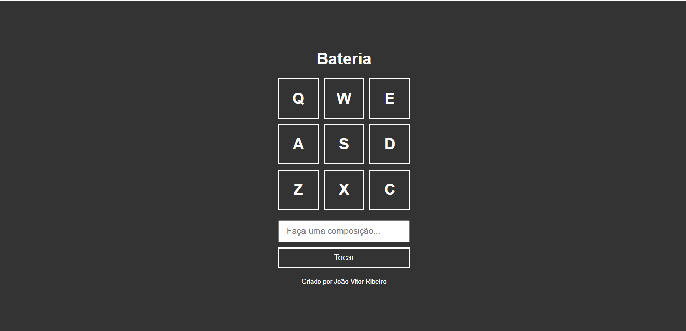

# 🛠 Tecnologias utilizadas:
 

  

  
   
  
  

 

# 💻  Sobre o Projeto:
<li>O Projeto Bateria é uma página web que permite aos usuários realizarem uma melodia com diferentes sons de bateria,sendo eles indeicados por letras.</li>
 

# ⚙️ Funcionalidades:
<li>Na primeira seção da página, os usuários serão apresentados uma barra de pesquisa que permite ao usuário compor melodias ao digitar letras específicas que estão logo acima da barra de pesquisa, diferentes sons de bateria são ativados ao digitar tais letra.</li>
<li>Além disso,logo abaixo da barra de pesquisa, adicionei um botão "Tocar", que reproduz a composição criada.</li>

# 🎨 Pré-visualização :
## Apresentação da bateria:

# 🦸 Autor:

 
<a href="https://www.linkedin.com/in/jo%C3%A3o-vitor-ribeiro-dias-339a56258/" target="_blank">João Vitor RIbeiro Dias</a>
